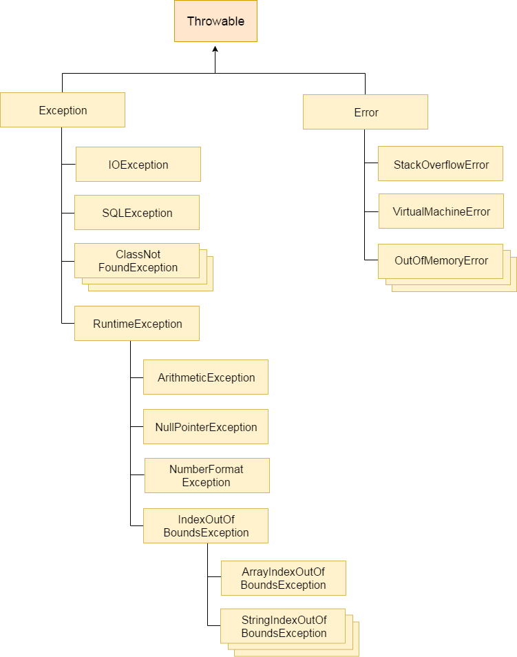
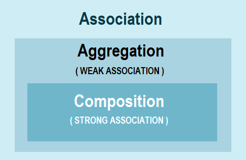
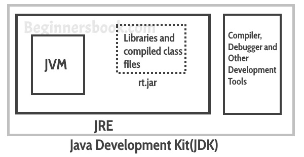

## Java, J2EE, JSP, Servlet, Hibernate Interview Questions

*Click  if you like the project. Pull Request are highly appreciated.*


### Table of Contents

* *[Java 8 Interview Questions](java8-questions.md)*
* *[Multithreading Interview Questions](multithreading-questions.md)*
* *[Collections Interview Questions](collections-questions.md)*
* *[Hibernate Interview Questions](hibernate-questions.md)*
* *[JDBC Interview Questions](JDBC-questions.md)*
* *[Java Programs](java-programs.md)*
* *[Java String Methods](java-string-methods.md)*
* *[JSP Interview Questions](jsp-questions.md)*
* *[Servlets Interview Questions](servlets-questions.md)*
* *[Java Design Pattern Questions](java-design-pattern-questions.md)*
* *[Java Multiple Choice Questions](java-multiple-choice-questions-answers.md)*

<br/>

## Q. ***What are the types of Exceptions? Explain the hierarchy of Java Exception classes?***
Exception is an error event that can happen during the execution of a program and disrupts its normal flow.

**Types of Java Exceptions**  

**1. Checked Exception**: The classes which directly inherit `Throwable class` except RuntimeException and Error are known as checked exceptions e.g. IOException, SQLException etc. Checked exceptions are checked at compile-time.  
**2. Unchecked Exception**: The classes which inherit `RuntimeException` are known as unchecked exceptions e.g. ArithmeticException, NullPointerException, ArrayIndexOutOfBoundsException etc. Unchecked exceptions are not checked at compile-time, but they are checked at runtime.  
**3. Error**: Error is irrecoverable e.g. OutOfMemoryError, VirtualMachineError, AssertionError etc.

**Hierarchy of Java Exception classes**   
The java.lang.Throwable class is the root class of Java Exception hierarchy which is inherited by two subclasses: Exception and Error. 




Example:
```java
import java.io.FileInputStream;
import java.io.FileNotFoundException;
import java.io.IOException;
import java.io.InputStream;

public class CustomExceptionExample {

	public static void main(String[] args) throws MyException {
		try {
			processFile("file.txt");
		} catch (MyException e) {
			processErrorCodes(e);
		}
	}

	private static void processErrorCodes(MyException e) throws MyException {
		switch(e.getErrorCode()){
		  case "BAD_FILE_TYPE":
			 System.out.println("Bad File Type, notify user");
			 throw e;
		  case "FILE_NOT_FOUND_EXCEPTION":
			 System.out.println("File Not Found, notify user");
			 throw e;
		  case "FILE_CLOSE_EXCEPTION":
			 System.out.println("File Close failed, just log it.");
			 break;
		  default:
			 System.out.println("Unknown exception occured," +e.getMessage());
			 e.printStackTrace();
		}
	}

	private static void processFile(String file) throws MyException {		
		InputStream fis = null;
		try {
			fis = new FileInputStream(file);
		} catch (FileNotFoundException e) {
			throw new MyException(e.getMessage(),"FILE_NOT_FOUND_EXCEPTION");
		} finally {
			try {
				if(fis !=null) fis.close();
			} catch (IOException e) {
				throw new MyException(e.getMessage(),"FILE_CLOSE_EXCEPTION");
			}
		}
	}
}
```
<div align="right">
    <b><a href="#">↥ back to top</a></b>
</div>

## Q. ***What is the difference between aggregation and composition?***




**Aggregation**: We call aggregation those relationships whose **objects have an independent lifecycle, but there is ownership**, and child objects cannot belong to another parent object.

Example: Since Organization has Person as employees, the relationship between them is Aggregation. Here is how they look like in terms of Java classes
```java
public class Organization {
   private List employees;
}

public class Person {
   private String name;   
}
```

**Composition**: We use the term composition to refer to relationships whose objects **don’t have an independent lifecycle**, and if the parent object is deleted, all child objects will also be deleted.

Example: Since Engine is-part-of Car, the relationship between them is Composition. Here is how they are implemented between Java classes.
```java
public class Car {
    //final will make sure engine is initialized
    private final Engine engine;  
       
    public Car(){
       engine  = new Engine();
    }
}

class Engine {
    private String type;
}
```

<table class="alt">
<tbody><tr><th>Aggregation</th><th>Composition</th></tr>
<tr><td>Aggregation is a weak Association.</td><td>Composition is a strong Association.</td></tr>
<tr><td>Class can exist independently without owner.</td><td>Class can not meaningfully exist without owner.</td></tr>
<tr><td>Have their own Life Time.</td><td>Life Time depends on the Owner.</td></tr>
<tr><td>A uses B.</td><td>A owns B.</td></tr>
<tr><td>Child is not owned by 1 owner.</td><td>Child can have only 1 owner.</td></tr>
<tr><td>Has-A relationship. A has B.</td><td>Part-Of relationship. B is part of A.</td></tr>
<tr><td>Denoted by a empty diamond in UML.</td><td>Denoted by a filled diamond in UML.</td></tr>
<tr><td>We do not use "final" keyword for Aggregation.</td><td>"final" keyword is used to represent Composition.</td></tr>
<tr><td>Examples:<br>- Car has a Driver.<br>- A Human uses Clothes.<br>- A Company is an aggregation of People.<br>- A Text Editor uses a File.<br>- Mobile has a SIM Card.</td><td>Examples:<br>- Engine is a part of Car.<br>- A Human owns the Heart.<br>- A Company is a composition of Accounts.<br>- A Text Editor owns a Buffer.<br>- IMEI Number is a part of a Mobile.</td></tr>
</tbody></table>

*Note: "final" keyword is used in Composition to make sure child variable is initialized.*

<div align="right">
    <b><a href="#">↥ back to top</a></b>
</div>

## Q. ***What is difference between Heap and Stack Memory in java?***
**Java Heap Space**  

Java Heap space is used by java runtime to allocate memory to Objects and JRE classes. Whenever we create any object, it’s always created in the Heap space.

Garbage Collection runs on the heap memory to free the memory used by objects that doesn’t have any reference. Any object created in the heap space has global access and can be referenced from anywhere of the application.

**Java Stack Memory**  

Stack in java is a section of memory which contains methods, local variables and reference variables. Local variables are created in the stack.

Stack memory is always referenced in LIFO (Last-In-First-Out) order. Whenever a method is invoked, a new block is created in the stack memory for the method to hold local primitive values and reference to other objects in the method.

As soon as method ends, the block becomes unused and become available for next method. Stack memory size is very less compared to Heap memory.

**Difference**  


|Parameter	       |Stack Memory	               |Heap Space                       |
|------------------|-----------------------------|-----------------------------------|
|Application	   |Stack is used in parts, one at a time during execution of a thread|	The entire application uses Heap space during runtime|
|Size	           |Stack has size limits depending upon OS and is usually smaller then Heap|There is no size limit on Heap|
|Storage	       |Stores only primitive variables and references to objects that are created in Heap Space|All the newly created objects are stored here|
|Order	           |It is accessed using Last-in First-out (LIFO) memory allocation system|	This memory is accessed via complex memory management techniques that include Young Generation, Old or Tenured Generation, and Permanent Generation.|
|Life	           |Stack memory only exists as long as the current method is running|Heap space exists as long as the application runs|
|Efficiency	       |Comparatively much faster to allocate when compared to heap| Slower to allocate when compared to stack|
|Allocation/Deallocation| This Memory is automatically allocated and deallocated when a method is called and returned respectively|Heap space is allocated when new objects are created and deallocated by Gargabe Collector when they are no longer referenced |

<div align="right">
    <b><a href="#">↥ back to top</a></b>
</div>

## Q. ***What is JVM and is it platform independent?***
Java Virtual Machine (JVM) is a specification that provides runtime environment in which java bytecode(.class files) can be executed. The JVM is the platform. The JVM acts as a "virtual" machine or processor. Java's platform independence consists mostly of its Java Virtual Machine (JVM). JVM makes this possible because it is aware of the specific instruction lengths and other particularities of the platform (Operating System).

The JVM is not platform independent. Java Virtual Machine (JVM) provides the environment to execute the java file(. Class file). So at the end it's depends on kernel and kernel is differ from OS (Operating System) to OS. The JVM is used to both translate the bytecode into the machine language for a particular computer and actually execute the corresponding machine-language instructions as well.

<div align="right">
    <b><a href="#">↥ back to top</a></b>
</div>

## Q. ***What is JIT compiler in Java?***
The Just-In-Time (JIT) compiler is a component of the runtime environment that improves the performance of Java applications by compiling bytecodes to native machine code at run time.

Java programs consists of classes, which contain platform-neutral bytecodes that can be interpreted by a JVM on many different computer architectures. At run time, the JVM loads the class files, determines the semantics of each individual bytecode, and performs the appropriate computation. The additional processor and memory usage during interpretation means that a Java application performs more slowly than a native application. The JIT compiler helps improve the performance of Java programs by compiling bytecodes into native machine code at run time. The JIT compiler is enabled by default. When a method has been compiled, the JVM calls the compiled code of that method directly instead of interpreting it. 

<div align="right">
    <b><a href="#">↥ back to top</a></b>
</div>

## Q. ***What is Classloader in Java? What are different types of classloaders?***
The **Java ClassLoader** is a part of the Java Runtime Environment that dynamically loads Java classes into the Java Virtual Machine. Java code is compiled into class file by javac compiler and JVM executes Java program, by executing byte codes written in class file. ClassLoader is responsible for loading class files from file system, network or any other source. 

**Types of ClassLoader**   

**a) Bootstrap Class Loader**: It loads standard JDK class files from rt.jar and other core classes. It loads class files from jre/lib/rt.jar. For example, java.lang package class.

**b) Extensions Class Loader**: It loads classes from the JDK extensions directly usually `JAVA_HOME/lib/ext` directory or any other directory as java.ext.dirs. 

**c) System Class Loader**: It loads application specific classes from the CLASSPATH environment variable. It can be set while invoking program using -cp or classpath command line options. 

<div align="right">
    <b><a href="#">↥ back to top</a></b>
</div>

## Q. ***Java Compiler is stored in JDK, JRE or JVM?***
**JDK**: Java Development Kit is the core component of Java Environment and provides all the tools, executables and binaries required to compile, debug and execute a Java Program. 

**JVM**: JVM is responsible for converting Byte code to the machine specific code. JVM is also platform dependent and provides core java functions like memory management, garbage collection, security etc. JVM is customizable and we can use java options to customize it, for example allocating minimum and maximum memory to JVM. JVM is called virtual because it provides an interface that does not depend on the underlying operating system and machine hardware.

**JRE**: Java Runtime Environment provides a platform to execute java programs. JRE consists of JVM and java binaries and other classes to execute any program successfully.




<div align="right">
    <b><a href="#">↥ back to top</a></b>
</div>

## Q. ***What is the difference between factory and abstract factory pattern?***
The Factory Method is usually categorised by a switch statement where each case returns a different class, using the same root interface so that the calling code never needs to make decisions about the implementation.

For example credit card validator factory which returns a different validator for each card type.
```java
public ICardValidator GetCardValidator (string cardType)
{
    switch (cardType.ToLower())
    {
        case "visa":
            return new VisaCardValidator();
        case "mastercard":
        case "ecmc":
            return new MastercardValidator();
        default:
            throw new CreditCardTypeException("Do not recognise this type");
    }
}
```
Abstract Factory patterns work around a super-factory which creates other factories. This factory is also called as factory of factories. This type of design pattern comes under creational pattern as this pattern provides one of the best ways to create an object.

In Abstract Factory pattern an interface is responsible for creating a factory of related objects without explicitly specifying their classes. Each generated factory can give the objects as per the Factory pattern.

<div align="right">
    <b><a href="#">↥ back to top</a></b>
</div>

## Q. ***What are the methods used to implement for key Object in HashMap?***
**1. equals()** and **2. hashcode()**
Class inherits methods from the following classes in terms of HashMap

* java.util.AbstractMap
* java.util.Object
* java.util.Map

<div align="right">
    <b><a href="#">↥ back to top</a></b>
</div>

## Q. ***What is difference between the Inner Class and Sub Class?***
Nested Inner class can access any private instance variable of outer class. Like any other instance variable, we can have access modifier private, protected, public and default modifier.
```java
class Outer { 
   class Inner { 
      public void show() { 
           System.out.println("In a nested class method"); 
      } 
   } 
} 
class Main { 
   public static void main(String[] args) { 
       Outer.Inner in = new Outer().new Inner(); 
       in.show(); 
   } 
} 
```
A subclass is class which inherits a method or methods from a superclass.
```java
class Car {
    //...
}
 
class HybridCar extends Car {
    //...
}
```
<div align="right">
    <b><a href="#">↥ back to top</a></b>
</div>

## Q. ***Can we import same package/class two times? Will the JVM load the package twice at runtime?***
We can import the same package or same class multiple times. The JVM will internally load the class only once no matter how many times import the same class.

<div align="right">
    <b><a href="#">↥ back to top</a></b>
</div>

## Q. ***Distinguish between static loading and dynamic class loading?***
**Static Class Loading**: Creating objects and instance using `new` keyword is known as static class loading. The retrieval of class definition and instantiation of the object is done at compile time.
```java
class TestClass {
  public static void main(String args[]) {
      TestClass tc = new TestClass();
  }
}
```

**Dynamic Class Loading**: Loading classes use `Class.forName()` method. Dynamic class loading is done when the name of the class is not known at compile time.
```java
Class.forName (String className);
```
<div align="right">
    <b><a href="#">↥ back to top</a></b>
</div>

## Q. ***What is the difference between transient and volatile variable in Java?***
**Transient**: The transient modifier tells the Java object serialization subsystem to exclude the field when serializing an instance of the class. When the object is then deserialized, the field will be initialized to the default value; i.e. null for a reference type, and zero or false for a primitive type.
```java
public transient int limit = 55;   // will not persist
public int b;   // will persist
```
**Volatile**: The volatile modifier tells the JVM that writes to the field should always be synchronously flushed to memory, and that reads of the field should always read from memory. This means that fields marked as volatile can be safely accessed and updated in a multi-thread application without using native or standard library-based synchronization.
```java
public class MyRunnable implements Runnable {
   private volatile boolean active;
   public void run() {
      active = true;
      while (active) {    
      }
   }
   public void stop() {
      active = false;  
   }
}
```

<div align="right">
    <b><a href="#">↥ back to top</a></b>
</div>

## Q. ***How many types of memory areas are allocated by JVM?***
JVM is a program which takes Java bytecode and converts the byte code (line by line) into machine understandable code. JVM perform some particular types of operations:

* Loading of code
* Verification of code
* Executing the code
* It provide run-time environment to the users

**Types of Memory areas allocated by the JVM:**  

**1. Classloader**: Classloader is a subsystem of JVM that is used to load class files.  
**2. Class(Method) Area**: Class(Method) Area stores per-class structures such as the runtime constant pool, field and method data, the code for methods.  
**3. Heap**: It is the runtime data area in which objects are allocated.  
**4. Stack**: Java Stack stores frames.It holds local variables and partial results, and plays a part in method invocation and return. Each thread has a private JVM stack, created at the same time as thread.  
**5. Program Counter Register**: PC (program counter) register. It contains the address of the Java virtual machine instruction currently being executed.  
**6. Native Method Stack**: It contains all the native methods used in the application.

<div align="right">
    <b><a href="#">↥ back to top</a></b>
</div>

## Q. ***What will be the initial value of an object reference which is defined as an instance variable?***
The object references are all initialized to `null` in Java. However in order to do anything useful with these references, It must set to a valid object, else you will get NullPointerExceptions everywhere you try to use such default initialized references.

<div align="right">
    <b><a href="#">↥ back to top</a></b>
</div>

## Q. ***How can constructor chaining be done using this keyword?***
Java constructor chaining is a method of calling one constructor with the help of another while considering the present object. It can be done in 2 ways –

* **Within same class**: It can be done using `this()` keyword for constructors in the same class.
* **From base class**: By using `super()` keyword to call a constructor from the base class.

```java
// Java program to illustrate Constructor Chaining 
// within same class Using this() keyword 
class Temp 
{ 
    // default constructor 1 
    // default constructor will call another constructor 
    // using this keyword from same class 
    Temp() { 
        // calls constructor 2 
        this(5); 
        System.out.println("The Default constructor"); 
    } 
  
    // parameterized constructor 2 
    Temp(int x) { 
        // calls constructor 3 
        this(10, 20); 
        System.out.println(x); 
    } 
  
    // parameterized constructor 3 
    Temp(int x, int y) { 
        System.out.println(10 + 20); 
    } 
  
    public static void main(String args[]) { 
        // invokes default constructor first 
        new Temp(); 
    } 
} 
```
Ouput:
```
30
10
The Default constructor
```
```java
// Java program to illustrate Constructor Chaining to 
// other class using super() keyword 
class Base 
{ 
    String name; 
  
    // constructor 1 
    Base() { 
        this(""); 
        System.out.println("No-argument constructor of base class"); 
    } 
  
    // constructor 2 
    Base(String name) { 
        this.name = name; 
        System.out.println("Calling parameterized constructor of base"); 
    } 
} 
  
class Derived extends Base 
{ 
    // constructor 3 
    Derived() { 
        System.out.println("No-argument constructor of derived"); 
    } 
  
    // parameterized constructor 4 
    Derived(String name) { 
        // invokes base class constructor 2 
        super(name); 
        System.out.println("Calling parameterized constructor of derived"); 
    } 
  
    public static void main(String args[]) { 
        // calls parameterized constructor 4 
        Derived obj = new Derived("test"); 
  
        // Calls No-argument constructor 
        // Derived obj = new Derived(); 
    } 
} 
```
Output:
```
Calling parameterized constructor of base
Calling parameterized constructor of derived
```
<div align="right">
    <b><a href="#">↥ back to top</a></b>
</div>

## Q. ***Can you declare the main method as final?***
Yes. We can declare main method as final. But, In inheritance concept we cannot declare main method as final in parent class. It give compile time error. The main method has to be public because it has to be called by JVM which is outside the scope of the package and hence would need the access specifier-public.
```java
public class Test {
	public final static void main(String[] args) throws Exception {
		System.out.println("This is Test Class");
	}
}
 
class Child extends Test {
	public static void main(String[] args) throws Exception {
		System.out.println("This is Child Class");
	}
}
```
Output
```
Cannot override the final method from Test.
```
<div align="right">
    <b><a href="#">↥ back to top</a></b>
</div>

## Q. ***What is the difference between the final method and abstract method?***
Final method is a method that is marked as final, i.e. it cannot be overridden anymore. Just like final class cannot be inherited anymore.

Abstract method, on the other hand, is an empty method that is ought to be overridden by the inherited class. Without overriding, you will quickly get compilation error.

<div align="right">
    <b><a href="#">↥ back to top</a></b>
</div>

## Q. ***What is the difference between compile-time polymorphism and runtime polymorphism?***
There are two types of polymorphism in java:
1) Static Polymorphism also known as compile time polymorphism
2) Dynamic Polymorphism also known as runtime polymorphism

**Example of static Polymorphism**  

Method overloading is one of the way java supports static polymorphism. Here we have two definitions of the same method add() which add method would be called is determined by the parameter list at the compile time. That is the reason this is also known as compile time polymorphism.
```java
class SimpleCalculator
{
    int add(int a, int b) {
         return a + b;
    }
    int  add(int a, int b, int c) {
         return a + b + c;
    }
}
public class Demo
{
   public static void main(String args[]) {

	   SimpleCalculator obj = new SimpleCalculator();
      System.out.println(obj.add(10, 20));
      System.out.println(obj.add(10, 20, 30));
   }
}
```
Output:
```
30
60
```
**Runtime Polymorphism (or Dynamic polymorphism)**  

It is also known as Dynamic Method Dispatch. Dynamic polymorphism is a process in which a call to an overridden method is resolved at runtime, thats why it is called runtime polymorphism. 
```java
class ABC {

   public void myMethod() {
	System.out.println("Overridden Method");
   }
}
public class XYZ extends ABC {

   public void myMethod() {
	System.out.println("Overriding Method");
   }
   public static void main(String args[]) {
	ABC obj = new XYZ();
	obj.myMethod();
   }
}
```
Output:
```
Overriding Method
```
<div align="right">
    <b><a href="#">↥ back to top</a></b>
</div>

## Q. ***Can you achieve Runtime Polymorphism by data members?***
No, we cannot achieve runtime polymorphism by data members. Method is overridden not the data members, so runtime polymorphism can not be achieved by data members.

<div align="right">
    <b><a href="#">↥ back to top</a></b>
</div>

## Q. ***Can you have virtual functions in Java?***
In Java, all non-static methods are by default **virtual functions**. Only methods marked with the `keyword final`, which cannot be overridden, along with `private methods`, which are not inherited, are non-virtual.

**Virtual function with Interface** 
```java
/**
* The function applyBrakes() is virtual because
* functions in interfaces are designed to be overridden.
**/
interface Bicycle {         
    void applyBrakes();     
}                           

class ACMEBicycle implements Bicycle {
    public void applyBrakes(){               //Here we implement applyBrakes()
       System.out.println("Brakes applied"); //function
    }
}
```
<div align="right">
    <b><a href="#">↥ back to top</a></b>
</div>

## Q. ***What is covariant return type?***
It is possible to have different return type for a overriding method in child class, but child’s return type should be sub-type of parent’s return type. Overriding method becomes variant with respect to return type. The covariant return type specifies that the return type may vary in the same direction as the subclass.
```java
class SuperClass {
   SuperClass get() {
      System.out.println("SuperClass");
      return this;
   }
}
public class Tester extends SuperClass {
   Tester get() {
      System.out.println("SubClass");
      return this;
   }
   public static void main(String[] args) {
      SuperClass tester = new Tester();
      tester.get();
   }
}
```
Output:
```
Subclass
```
<div align="right">
    <b><a href="#">↥ back to top</a></b>
</div>

## Q. ***What is the difference between abstraction and encapsulation?***
* Abstraction solves the problem at design level while Encapsulation solves it implementation level. 
* In Java, Abstraction is supported using `interface` and `abstract class` while Encapsulation is supported using access modifiers e.g. public, private and protected.
* Abstraction is about hiding unwanted details while giving out most essential details, while Encapsulation means hiding the code and data into a single unit e.g. class or method to protect inner working of an object from outside world. 

<table class="alt">
<tbody><tr><th>Abstraction</th><th>Encapsulation</th></tr>
<tr><td>Abstraction is a process of hiding the implementation details and showing only functionality to the user.</td>
<td> Encapsulation is a process of wrapping code and data together into a single unit</td></tr>
<tr><td>Abstraction lets you focus on what the object does instead of how it does it.</td>
<td>Encapsulation provides you the control over the data and keeping it safe from outside misuse.</td></tr>
<tr><td>Abstraction solves the problem in the Design Level.</td>
<td>Encapsulation solves the problem in the Implementation Level.</td></tr>
<tr><td>Abstraction is implemented by using Interfaces and Abstract Classes.</td>
<td>Encapsulation is implemented by using Access Modifiers (private, default, protected, public)</td></tr>
<tr><td>Abstraction means hiding implementation complexities by using interfaces and abstract class.</td>
<td>Encapsulation means hiding data by using setters and getters.</td></tr>
</tbody></table>

<div align="right">
    <b><a href="#">↥ back to top</a></b>
</div>

## Q. ***Can there be an abstract method without an abstract class?***
Yes. because methods in an interface are also abstract. so the interface can be use to declare abstract method.

<div align="right">
    <b><a href="#">↥ back to top</a></b>
</div>

## Q. ***Can we use private or protected member variables in an interface?***
The java compiler adds public and abstract keywords before the interface method and **public, static and final keyword** before data members automatically
```java
public interface Test {
   public string name1;
   private String email;
   protected pass;
}
```
as you have declare variable in test interface with private and protected it will give error. if you do not specify the modifier the compiler will add public static final automatically.
```java
public interface Test {
   public static final string name1;
   public static final  String email;
   public static final pass;
}
```
* interfaces cannot be instantiated that is why the variable are **static**
* interface are used to achieve the 100% abstraction there for the variable are **final**
* An interface provide a way for the client to interact with the object. If variables were not public, the clients would not have access to them. that is why variable are **public**

<div align="right">
    <b><a href="#">↥ back to top</a></b>
</div>

## Q. ***When can an object reference be cast to a Java interface reference?***
An interface reference can point to any object of a class that implements this interface 
```java
interface Foo {
  void display();
}

public class TestFoo implements Foo {

    void display() {
      System.out.println("Hello World");
    }

    public static void main(String[] args) {
      Foo foo = new TestFoo();
      foo.display();
    }
}
``` 
<div align="right">
    <b><a href="#">↥ back to top</a></b>
</div>

## Q. ***Give the hierarchy of InputStream and OutputStream classes?***
A stream can be defined as a sequence of data. There are two kinds of Streams −

* **InPutStream** − The InputStream is used to read data from a source.
* **OutPutStream** − The OutputStream is used for writing data to a destination.

**Byte Streams**  
Java byte streams are used to perform input and output of 8-bit bytes. Though there are many classes related to byte streams but the most frequently used classes are, FileInputStream and FileOutputStream.

```java
import java.io.*;
public class CopyFile {

   public static void main(String args[]) throws IOException {  
      FileInputStream in = null;
      FileOutputStream out = null;

      try {
         in = new FileInputStream("input.txt");
         out = new FileOutputStream("output.txt");
         
         int c;
         while ((c = in.read()) != -1) {
            out.write(c);
         }
      } finally {
         if (in != null) {
            in.close();
         }
         if (out != null) {
            out.close();
         }
      }
   }
}
```
**Character Streams**  
Java Byte streams are used to perform input and output of 8-bit bytes, whereas Java Character streams are used to perform input and output for 16-bit unicode. Though there are many classes related to character streams but the most frequently used classes are, FileReader and FileWriter. 

```java
import java.io.*;
public class CopyFile {

   public static void main(String args[]) throws IOException {
      FileReader in = null;
      FileWriter out = null;

      try {
         in = new FileReader("input.txt");
         out = new FileWriter("output.txt");
         
         int c;
         while ((c = in.read()) != -1) {
            out.write(c);
         }
      } finally {
         if (in != null) {
            in.close();
         }
         if (out != null) {
            out.close();
         }
      }
   }
}
```
<div align="right">
    <b><a href="#">↥ back to top</a></b>
</div>

## Q. ***Can you access non static variable in static context?***
No, non-static variable cannot be referenced in a static context directly one needs to use object.

<div align="right">
    <b><a href="#">↥ back to top</a></b>
</div>

## Q. ***What is the purpose of the Runtime class and System class?***
**Runtime Class**: The purpose of the Runtime class is to provide access to the Java runtime system. The runtime information like memory availability, invoking the garbage collector, etc.

**System Class**: The purpose of the System class is to provide access to system resources. It contains accessibility to standard input, standart output, error output streams, current time in millis, terminating the application, etc.

<div align="right">
    <b><a href="#">↥ back to top</a></b>
</div>

## Q. ***What are assertions in Java?***
An assertion allows testing the correctness of any assumptions that have been made in the program. Assertion is achieved using the assert statement in Java. While executing assertion, it is believed to be true. If it fails, JVM throws an error named `AssertionError`. It is mainly used for testing purposes during development.

The assert statement is used with a Boolean expression and can be written in two different ways.
```
// First way 
assert expression;

// Second way
assert expression1 : expression2;
```
Example:
```java
public class Example {
   public static void main(String[] args) {
      int age = 14;
      assert age <= 18 : "Cannot Vote";
      System.out.println("The voter's age is " + age);
   }
}
```
<div align="right">
    <b><a href="#">↥ back to top</a></b>
</div>

## Q. ***Can we have multiple public classes in a java source file?***
A Java source file can have only one class declared as **public**, we cannot put two or more public classes together in a **.java** file. This is because of the restriction that the file name should be same as the name of the public class with **.java** extension. If we want to multiple classes under consideration are to be declared as public, we have to store them in separate source files and attach the package statement as the first statement in those source files.

<div align="right">
    <b><a href="#">↥ back to top</a></b>
</div>

## Q. ***What is the difference between abstract class and interface?***
Abstract class and interface both are used to achieve abstraction where we can declare the abstract methods. Abstract class and interface both can't be instantiated.

|Sl.No|Abstract Class	            |Interface                        |
|-----|-----------------------------|---------------------------------|
| 01. |Abstract class can have abstract and non-abstract methods.|	Interface can have only abstract methods. Since Java 8, it can have default and static methods also.|
| 02. |Abstract class doesn't support multiple inheritance.|	Interface supports multiple inheritance.|
| 03. |Abstract class can have final, non-final, static and non-static variables.	|Interface has only static and final variables.|
| 04. |Abstract class can provide the implementation of interface.|Interface can't provide the implementation of abstract class.|
| 05. |The abstract keyword is used to declare abstract class.|The interface keyword is used to declare interface.|
| 06. |An abstract class can extend another Java class and implement multiple Java interfaces.|An interface can extend another Java interface only.|
| 07. |An abstract class can be extended using keyword "extends".|An interface can be implemented using keyword "implements".|
| 08. |A Java abstract class can have class members like private, protected, etc.|Members of a Java interface are public by default.|

<div align="right">
    <b><a href="#">↥ back to top</a></b>
</div>

## Q. ***What are Wrapper classes?***
The wrapper class in Java provides the mechanism to convert primitive into object and object into primitive.

**Use of Wrapper classes in Java**  

* **Change the value in Method**: Java supports only call by value. So, if we pass a primitive value, it will not change the original value. But, if we convert the primitive value in an object, it will change the original value.
* **Serialization**: We need to convert the objects into streams to perform the serialization. If we have a primitive value, we can convert it in objects through the wrapper classes.
* **Synchronization**: Java synchronization works with objects in Multithreading.
* **java.util package**: The java.util package provides the utility classes to deal with objects.
* **Collection Framework**: Java collection framework works with objects only. All classes of the collection framework (ArrayList, LinkedList, Vector, HashSet, LinkedHashSet, TreeSet, PriorityQueue, ArrayDeque, etc.) deal with objects only.

| Sl.No|Primitive Type  |	Wrapper class       |
|------|----------------|----------------------|
| 01.  |boolean	      |Boolean|
| 02.  |char	         |Character|
| 03.  |byte	         |Byte|
| 04.  |short	         |Short|
| 05.  |int	            |Integer|
| 06.  |long	         |Long|
| 07.  |float	         |Float|
| 08.  |double	         |Double|

Example: Primitive to Wrapper
```java
//Java program to convert primitive into objects  
//Autoboxing example of int to Integer  
class WrapperExample {  
  public static void main(String args[]){  
      //Converting int into Integer  
      int a=20;  
      Integer i = Integer.valueOf(a);//converting int into Integer explicitly  
      Integer j = a; //autoboxing, now compiler will write Integer.valueOf(a) internally  
  
   System.out.println(a+" "+i+" "+j);  
  }
}  
```
Output
```
20 20 20
```
<div align="right">
    <b><a href="#">↥ back to top</a></b>
</div>

## Q. ***What is Java Reflection API?***
Java Reflection is the process of analyzing and modifying all the capabilities of a class at runtime. Reflection API in Java is used to manipulate class and its members which include fields, methods, constructor, etc. at runtime. The **java.lang.Class** class provides many methods that can be used to get metadata, examine and change the run time behavior of a class.

There are 3 ways to get the instance of Class class. They are as follows:

* forName() method of Class class
* getClass() method of Object class
* the .class syntax

**1. forName() method of Class class**  

* is used to load the class dynamically.
* returns the instance of Class class.
* It should be used if you know the fully qualified name of class.This cannot be used for primitive types.
```java
class Simple{}  
  
class Test {  
   public static void main(String args[]) {  
      Class c = Class.forName("Simple");  
      System.out.println(c.getName());  
   }  
}  
```
Output
```
Simple
```
**2. getClass() method of Object class**  

It returns the instance of Class class. It should be used if you know the type. Moreover, it can be used with primitives.
```java
class Simple{}  
  
class Test {  
  void printName(Object obj) {  
    Class c=obj.getClass();    
    System.out.println(c.getName());  
  }  
  public static void main(String args[]) {  
    Simple s=new Simple();  
    Test t=new Test();  
    t.printName(s);  
  }  
}  
```
Output
```
Simple
```
**3. The .class syntax**  

If a type is available but there is no instance then it is possible to obtain a Class by appending ".class" to the name of the type.It can be used for primitive data type also.
```java
class Test {  
  public static void main(String args[]) {  
   Class c = boolean.class;   
   System.out.println(c.getName());  
  
   Class c2 = Test.class;   
   System.out.println(c2.getName());  
 }  
}  
```
Output
```
boolean
Test
```
<div align="right">
    <b><a href="#">↥ back to top</a></b>
</div>

## Q. ***What is the default value of the local variables?***
There is no default value for local variables, so local variables should be declared and an initial value should be assigned before the first use.

<div align="right">
    <b><a href="#">↥ back to top</a></b>
</div>

## Q. ***How many types of constructors are used in Java?***
In Java, a constructor is a block of codes similar to the method. It is called when an instance of the class is created. At the time of calling constructor, memory for the object is allocated in the memory.

**Types of Java Constructors**  

* Default Constructor (or) no-arg Constructor
* Parameterized Constructor

Example: Default Constructor (or) no-arg constructor
```java
public class Car 
{
    Car() {
      System.out.println("Default Constructor of Car class called");
    }
    public static void main(String args[]) {
      //Calling the default constructor
      Car c = new Car();
    }
}
```
Output
```
Default Constructor of Car class called
```
Example: Parameterized Constructor   
```java
public class Car 
{
    String carColor;
    Car(String carColor) {
        this.carColor = carColor;
    }
    
    public void disp() {
        System.out.println("Color of the Car is : "+carColor);
    }
    public static void main(String args[]) {
        //Calling the parameterized constructor
        Car c = new Car("Blue");
        c.disp();
    }
}
```
<div align="right">
    <b><a href="#">↥ back to top</a></b>
</div>

## Q. ***What are the restrictions that are applied to the Java static methods?***
If a method is declared as static, it is a member of a class rather than belonging to the object of the class. It can be called without creating an object of the class. A static method also has the power to access static data members of the class.

* There are a few restrictions imposed on a static method
* The static method cannot use non-static data member or invoke non-static method directly.
* The `this` and `super` cannot be used in static context.
* The static method can access only static type data (static type instance variable).
* There is no need to create an object of the class to invoke the static method.
* A static method cannot be overridden in a subclass

```java
class Parent {
   static void display() {
      System.out.println("Super class");    
   }
}
public class Example extends Parent {
   void display()  // trying to override display() {
      System.out.println("Sub class");  
   }
   public static void main(String[] args) {
      Parent obj = new Example();
      obj.display();
   }
}
```
This generates a compile time error. The output is as follows −
```
Example.java:10: error: display() in Example cannot override display() in Parent
void display()  // trying to override display()
     ^
overridden method is static

1 error
```
<div align="right">
    <b><a href="#">↥ back to top</a></b>
</div>

## Q. ***What is the final variable, final class, and final blank variable?***
**Final Variable**: final variables are nothing but constants. We cannot change the value of a final variable once it is initialized.
```java
class Demo {  

   final int MAX_VALUE = 99;
   void myMethod() {  
      MAX_VALUE = 101;
   }  
   public static void main(String args[]) {  
      Demo obj = new  Demo();  
      obj.myMethod();  
   }  
}
```
Output
```
Exception in thread "main" java.lang.Error: Unresolved compilation problem: 
	The final field Demo.MAX_VALUE cannot be assigned

	at beginnersbook.com.Demo.myMethod(Details.java:6)
	at beginnersbook.com.Demo.main(Details.java:10)
```
**Blank final variable**: A final variable that is not initialized at the time of declaration is known as blank final variable. We must initialize the blank final variable in constructor of the class otherwise it will throw a compilation error (Error: `variable MAX_VALUE might not have been initialized`).
```java
class Demo {  
   //Blank final variable
   final int MAX_VALUE;
	 
   Demo() {
      //It must be initialized in constructor
      MAX_VALUE = 100;
   }
   void myMethod() {  
      System.out.println(MAX_VALUE);
   }  
   public static void main(String args[]) {  
      Demo obj = new  Demo();  
      obj.myMethod();  
   }  
}
```
Output
```
100
```
**Final Method**: A final method cannot be overridden. Which means even though a sub class can call the final method of parent class without any issues but it cannot override it.
```java
class XYZ {  
   final void demo() {
      System.out.println("XYZ Class Method");
   }  
}  
	     
class ABC extends XYZ {  
   void demo() {
      System.out.println("ABC Class Method");
   }  
	     
   public static void main(String args[]) {  
      ABC obj= new ABC();  
      obj.demo();  
   }  
}
```
<div align="right">
    <b><a href="#">↥ back to top</a></b>
</div>

## Q. ***What is the static import?***
The static import feature of Java 5 facilitate the java programmer to access any static member of a class directly. There is no need to qualify it by the class name.
```java
import static java.lang.System.*;    
class StaticImportExample {

  public static void main(String args[]) {    
   out.println("Hello");//Now no need of System.out  
   out.println("Java");  
  }   
}  
```
<div align="right">
    <b><a href="#">↥ back to top</a></b>
</div>

## Q. ***Name some classes present in java.util.regex package?***
**Java Regex**: The Java Regex or Regular Expression is an API to define a pattern for searching or manipulating strings.

**java.util.regex package**  

* MatchResult interface
* Matcher class
* Pattern class
* PatternSyntaxException class

```java
import java.util.regex.*;  
public class RegexExample {  
   public static void main(String args[]) {  
      //1st way  
      Pattern p = Pattern.compile(".s");//. represents single character  
      Matcher m = p.matcher("as");  
      boolean b = m.matches();  
      
      //2nd way  
      boolean b2 = Pattern.compile(".s").matcher("as").matches();  
      
      //3rd way  
      boolean b3 = Pattern.matches(".s", "as");  
      
      System.out.println(b + " " + b2 + " " + b3);  
   }
}  
```
<div align="right">
    <b><a href="#">↥ back to top</a></b>
</div>

## Q. ***How will you invoke any external process in Java?***
We can invoke the external process in Java using **exec()** method of **Runtime Class**.
```java
class ExternalProcessExample 
{ 
    public static void main(String[] args) { 
        try { 
            // Command to create an external process 
            String command = "C:\Program Files (x86)"+ 
                 "\Google\Chrome\Application\chrome.exe"; 
  
            // Running the above command 
            Runtime run  = Runtime.getRuntime(); 
            Process proc = run.exec(command); 
        } catch (IOException e) { 
            e.printStackTrace(); 
        } 
    } 
} 
```
<div align="right">
    <b><a href="#">↥ back to top</a></b>
</div>

## Q. ***What is the purpose of using BufferedInputStream and BufferedOutputStream classes?***
`BufferedInputStream` and `BufferedOutputStream` class is used for buffering an input and output stream while reading and writing, respectively. It internally uses buffer to store data. It adds more efficiency than to write data directly into a stream. So, it makes the performance fast.

**BufferedInputStreamExample.java**
```java
import java.io.BufferedInputStream;
import java.io.File;
import java.io.FileInputStream;
import java.io.IOException;

public class BufferedInputStreamExample {

	public static void main(String[] args) {
		File file = new File("file.txt");
		FileInputStream fileInputStream = null;
		BufferedInputStream bufferedInputStream = null;

		try {
			fileInputStream = new FileInputStream(file);
			bufferedInputStream = new BufferedInputStream(fileInputStream);
			// Create buffer
			byte[] buffer = new byte[1024];
			int bytesRead = 0;
			while ((bytesRead = bufferedInputStream.read(buffer)) != -1) {
				System.out.println(new String(buffer, 0, bytesRead));
			}
		} catch (IOException e) {
			e.printStackTrace();
		} finally {
			try {
				if (fileInputStream != null) {
					fileInputStream.close();
				}
				if (bufferedInputStream != null) {
					bufferedInputStream.close();
				}
			} catch (IOException e) {
				e.printStackTrace();
			}
		}
	}
}
```
Output
```
This is an example of reading data from file
```
**BufferedOutputStreamExample.java**  
```java
import java.io.BufferedOutputStream;
import java.io.File;
import java.io.FileOutputStream;
import java.io.IOException;

public class BufferedOutputStreamExample {

	public static void main(String[] args) {
		File file = new File("outfile.txt");
		FileOutputStream fileOutputStream=null;
		BufferedOutputStream bufferedOutputStream=null;
		try {
			fileOutputStream = new FileOutputStream(file);
			bufferedOutputStream = new BufferedOutputStream(fileOutputStream);
			bufferedOutputStream.write("This is an example of writing data to a file".getBytes());
			bufferedOutputStream.flush();
			
		} catch (IOException e) {
			e.printStackTrace();
		} finally {
			try {
				if(fileOutputStream != null) {
					fileOutputStream.close();
				}
				if(bufferedOutputStream != null) {
					bufferedOutputStream.close();
				}
			} catch (IOException e) {
				e.printStackTrace();
			}
		}
	}
}
```
Output 
```
This is an example of writing data to a file
```
<div align="right">
    <b><a href="#">↥ back to top</a></b>
</div>

## Q. ***How to set the Permissions to a file in Java?***
Java 7 has introduced PosixFilePermission Enum and **java.nio.file.Files** includes a method setPosixFilePermissions(Path path, `Set<PosixFilePermission> perms`) that can be used to set file permissions easily.
```java
import java.io.File;
import java.io.IOException;
import java.nio.file.Files;
import java.nio.file.Paths;
import java.nio.file.attribute.PosixFilePermission;
import java.util.HashSet;
import java.util.Set;

public class FilePermissions {

    public static void main(String[] args) throws IOException {
        File file = new File("/Users/file.txt");
               
        //change permission to 777 for all the users
        //no option for group and others
        file.setExecutable(true, false);
        file.setReadable(true, false);
        file.setWritable(true, false);
        
        //using PosixFilePermission to set file permissions 777
        Set<PosixFilePermission> perms = new HashSet<PosixFilePermission>();
        //add owners permission
        perms.add(PosixFilePermission.OWNER_READ);
        perms.add(PosixFilePermission.OWNER_WRITE);
        perms.add(PosixFilePermission.OWNER_EXECUTE);
        //add group permissions
        perms.add(PosixFilePermission.GROUP_READ);
        perms.add(PosixFilePermission.GROUP_WRITE);
        perms.add(PosixFilePermission.GROUP_EXECUTE);
        //add others permissions
        perms.add(PosixFilePermission.OTHERS_READ);
        perms.add(PosixFilePermission.OTHERS_WRITE);
        perms.add(PosixFilePermission.OTHERS_EXECUTE);
        
        Files.setPosixFilePermissions(Paths.get("/Users/run.sh"), perms);
    }
}
```
<div align="right">
    <b><a href="#">↥ back to top</a></b>
</div>

## Q. ***In Java, How many ways you can take input from the console?***
In Java, there are three different ways for reading input from the user in the command line environment(console).

**1. Using Buffered Reader Class**: This method is used by wrapping the System.in (standard input stream) in an InputStreamReader which is wrapped in a BufferedReader, we can read input from the user in the command line.
```java
import java.io.BufferedReader; 
import java.io.IOException; 
import java.io.InputStreamReader; 
public class Test  
{ 
    public static void main(String[] args) throws IOException { 
        //Enter data using BufferReader 
        BufferedReader reader =  
                   new BufferedReader(new InputStreamReader(System.in)); 
         
        // Reading data using readLine 
        String name = reader.readLine(); 
  
        // Printing the read line 
        System.out.println(name);         
    } 
} 
```
**2. Using Scanner Class**: The main purpose of the Scanner class is to parse primitive types and strings using regular expressions, however it is also can be used to read input from the user in the command line.
```java
import java.util.Scanner; 
  
class GetInputFromUser 
{ 
    public static void main(String args[]) { 
        // Using Scanner for Getting Input from User 
        Scanner in = new Scanner(System.in); 
  
        String s = in.nextLine(); 
        System.out.println("You entered string "+s); 
  
        int a = in.nextInt(); 
        System.out.println("You entered integer "+a); 
  
        float b = in.nextFloat(); 
        System.out.println("You entered float "+b); 
    } 
} 
```  
**3. Using Console Class**: It has been becoming a preferred way for reading user’s input from the command line. In addition, it can be used for reading password-like input without echoing the characters entered by the user; the format string syntax can also be used (like System.out.printf()).
```java
public class Sample  
{ 
   public static void main(String[] args) {         
      // Using Console to input data from user 
      String name = System.console().readLine(); 
      System.out.println(name); 
   } 
}
```
<div align="right">
    <b><a href="#">↥ back to top</a></b>
</div>

## Q. ***How can you avoid serialization in child class if the base class is implementing the Serializable interface?***
If superClass has implemented Serializable that means subclass is also Serializable (as subclass always inherits all features from its parent class), for avoiding Serialization in sub-class we can define **writeObject()** method and throw **NotSerializableException()** from there as done below.
```java
import java.io.FileOutputStream;
import java.io.IOException;
import java.io.NotSerializableException;
import java.io.ObjectOutput;
import java.io.ObjectOutputStream;
import java.io.OutputStream;
import java.io.Serializable;

class Super implements Serializable {
   private static final long serialVersionUID = 1L;
}
 
class Sub extends Super {
    
    private static final long serialVersionUID = 1L;
    private Integer id;
    
    public Sub(Integer id) {
           this.id = id;
    }
 
    @Override
    public String toString() {
           return "Employee [id=" + id + "]";
    }
    
    /*
     * define how Serialization process will write objects.  
     */
   private void writeObject(ObjectOutputStream os) throws NotSerializableException {
         throw new NotSerializableException("This class cannot be Serialized");
   }
}
 
public class SerializeDeserialize {
 
    public static void main(String[] args) {
 
           Sub object1 = new Sub(8);
           try {
                  OutputStream fout = new FileOutputStream("ser.txt");
                  ObjectOutput oout = new ObjectOutputStream(fout);
                  System.out.println("Serialization process has started, serializing objects...");
                  oout.writeObject(object1);
                  fout.close();
                  oout.close();
                  System.out.println("Object Serialization completed.");
           } catch (IOException  e) {
                  e.printStackTrace();
           }
    }
}
```
Output
```
Serialization process has started, serializing objects...
java.io.NotSerializableException: This class cannot be Serialized
    at SerDeser11throwNotSerExc.Sub.writeObject(SerializeConstructorCheck.java:35)
    at sun.reflect.NativeMethodAccessorImpl.invoke0(Native Method)
    at sun.reflect.NativeMethodAccessorImpl.invoke(Unknown Source)
    at sun.reflect.DelegatingMethodAccessorImpl.invoke(Unknown Source)
    at java.lang.reflect.Method.invoke(Unknown Source)
    at java.io.ObjectStreamClass.invokeWriteObject(Unknown Source)
    at java.io.ObjectOutputStream.writeSerialData(Unknown Source)
    at java.io.ObjectOutputStream.writeOrdinaryObject(Unknown Source)
    at java.io.ObjectOutputStream.writeObject0(Unknown Source)
    at java.io.ObjectOutputStream.writeObject(Unknown Source)
    at SerDeser11throwNotSerExc.SerializeConstructorCheck.main(SerializeConstructorCheck.java:51)
```
<div align="right">
    <b><a href="#">↥ back to top</a></b>
</div>

## Q. ***What is the difference between Serializable and Externalizable interface?***

|Sl.No |SERIALIZABLE |	EXTERNALIZABLE        |
|----|----------------|-----------------------|
| 01.|Serializable is a marker interface i.e. does not contain any method.|	Externalizable interface contains two methods writeExternal() and readExternal() which implementing classes MUST override.|
| 02.|Serializable interface pass the responsibility of serialization to JVM and it’s default algorithm.|	Externalizable provides control of serialization logic to programmer – to write custom logic.|
| 03.|Mostly, default serialization is easy to implement, but has higher performance cost.|Serialization done using Externalizable, add more responsibility to programmer but often result in better performance.|
| 04.|It’s hard to analyze and modify class structure because any change may break the serialization.|	It’s more easy to analyze and modify class structure because of complete control over serialization logic.|
| 05.|Default serialization does not call any class constructor.|A public no-arg constructor is required while using Externalizable interface. |

<div align="right">
    <b><a href="#">↥ back to top</a></b>
</div>

## Q. ***What are the ways to instantiate the Class class?***
**1. Using new keyword**
```java
MyObject object = new MyObject();
```
**2. Using Class.forName()**
```java
MyObject object = (MyObject) Class.forName("subin.rnd.MyObject").newInstance();
```
**3. Using clone()**
```java
MyObject anotherObject = new MyObject();
MyObject object = (MyObject) anotherObject.clone();
```
**4. Using object deserialization**
```java
ObjectInputStream inStream = new ObjectInputStream(anInputStream );
MyObject object = (MyObject) inStream.readObject();
```
<div align="right">
    <b><a href="#">↥ back to top</a></b>
</div>

## Q. ***What is the purpose of using javap?***
The javap command displays information about the fields, constructors and methods present in a class file. The javap command (also known as the Java Disassembler) disassembles one or more class files. 

 ```java
class Simple {  
  public static void main(String args[]) {  
    System.out.println("Hello World");  
  }  
}  
```
```
cmd> javap Simple.class  
```
Output
```
Compiled from ".java"  
class Simple {  
  Simple();  
  public static void main(java.lang.String[]);  
}  
```
<div align="right">
    <b><a href="#">↥ back to top</a></b>
</div>

## Q. ***What are autoboxing and unboxing? When does it occur?***
The automatic conversion of primitive data types into its equivalent Wrapper type is known as boxing and opposite operation is known as unboxing.

Example: Autoboxing
```java
class BoxingExample1 {  
   public static void main(String args[]) {  
      int a = 50;  
      Integer a2 = new Integer(a); //Boxing  
      Integer a3 = 5; //Boxing  
      
      System.out.println(a2+" "+a3);  
   }   
}  
```

Example: Unboxing 
```java
class UnboxingExample1 {  
   public static void main(String args[]) {  
      Integer i = new Integer(50);  
      int a = i;  
          
      System.out.println(a);  
   }   
} 
```
<div align="right">
    <b><a href="#">↥ back to top</a></b>
</div>

## Q. ***What is a native method?***
A native method is a Java method (either an instance method or a class method) whose implementation is also written in another programming language such as C/C++. Moreover, a method marked as native cannot have a body and should end with a semicolon:

**Main.java**
```java
public class Main {
   public native int intMethod(int i);
   public static void main(String[] args) {
      System.loadLibrary("Main");
      System.out.println(new Main().intMethod(2));
   }
}
```
**Main.c**
```c
#include <jni.h>
#include "Main.h"

JNIEXPORT jint JNICALL Java_Main_intMethod(
    JNIEnv *env, jobject obj, jint i) {
  return i * i;
}
```
**Compile and run**  
```
javac Main.java
javah -jni Main
gcc -shared -fpic -o libMain.so -I${JAVA_HOME}/include \
  -I${JAVA_HOME}/include/linux Main.c
java -Djava.library.path=. Main
```
Output
```
4
```
<div align="right">
    <b><a href="#">↥ back to top</a></b>
</div>

## Q. ***What is immutable object? Can you write immutable object?***
Immutable objects are objects that don't change. A Java immutable object must have all its fields be internal, private final fields. It must not implement any setters. It needs a constructor that takes a value for every single field.

**Creating an Immutable Object**  

* Do not add any setter method
* Declare all fields final and private
* If a field is a mutable object create defensive copies of it for getter methods
* If a mutable object passed to the constructor must be assigned to a field create a defensive copy of it
* Don't allow subclasses to override methods.

```java
public class DateContainer {
  private final Date date;
  public DateContainer() {
      this.date = new Date();
  }
  public Date getDate() {
    return new Date(date.getTime());
  }
}
```
<div align="right">
    <b><a href="#">↥ back to top</a></b>
</div>

## Q. ***The difference between Inheritance and Composition?***
Though both Inheritance and Composition provides code reusablility, main difference between Composition and Inheritance in Java is that Composition allows reuse of code without extending it but for Inheritance you must extend the class for any reuse of code or functionality. Inheritance is an **"is-a"** relationship. Composition is a **"has-a"**.

Example: Inheritance 
```java
class Fruit {
   //...
}
class Apple extends Fruit {
   //...
}
```
Example: Composition 
```java
class Fruit {
   //...
}
class Apple {
   private Fruit fruit = new Fruit();
   //...
}
```
<div align="right">
    <b><a href="#">↥ back to top</a></b>
</div>

## Q. ***The difference between DOM and SAX parser in Java?***
DOM and SAX parser are extensively used to read and parse XML file in java and have their own set of advantage and disadvantage. 

|                 |DOM (Document Object Model)     |Parser	SAX (Simple API for XML) Parser           |
|-----------------|--------------------------------|--------------------------------------------------|
|Abbreviation	   |DOM stands for Document Object Model|	SAX stands for Simple API for XML Parsing    |
|type	            |Load entire memory and keep in tree structure|	event based parser                  |
|size of Document	|good for smaller size	         |good to choose for larger size of file.           |
|Load	            |Load entire document in memory	|does not load entire document.                    |
|suitable	      |better suitable for smaller and efficient memory|	SAX is suitable for larger XML doc|

<div align="right">
    <b><a href="#">↥ back to top</a></b>
</div>

## Q. ***What is the difference between creating String as new() and literal?***
When you create String object using `new()` operator, it always create a new object in heap memory. On the other hand, if you create object using String literal syntax e.g. "Java", it may return an existing object from String pool (a cache of String object in Perm gen space, which is now moved to heap space in recent Java release), if it's already exists. Otherwise it will create a new string object and put in string pool for future re-use.
```java
String a = "abc"; 
String b = "abc";
System.out.println(a == b);  // true

String c = new String("abc");
String d = new String("abc");
System.out.println(c == d);  // false
```
<div align="right">
    <b><a href="#">↥ back to top</a></b>
</div>

## Q. ***How can we create an immutable class in Java?***
Immutable class means that once an object is created, we cannot change its content. In Java, all the wrapper classes (like Integer, Boolean, Byte, Short) and String class is immutable. 

**Rules to create immutable classes**  

* The class must be declared as final (So that child classes can’t be created)
* Data members in the class must be declared as final (So that we can’t change the value of it after object creation)
* A parameterized constructor
* Getter method for all the variables in it
* No setters(To not have the option to change the value of the instance variable)

```java
public final class Employee {  

   final String pancardNumber;  
   
   public Employee(String pancardNumber) {  
      this.pancardNumber = pancardNumber;  
   }  
   public String getPancardNumber() {  
      return pancardNumber;  
   }
}  
```
<div align="right">
    <b><a href="#">↥ back to top</a></b>
</div>

## Q. ***What is difference between String, StringBuffer and StringBuilder?***
**Mutability Difference:**  `String` is **immutable**, if you try to alter their values, another object gets created, whereas `StringBuffer` and `StringBuilder` are **mutable** so they can change their values.

**Thread-Safety Difference:** The difference between `StringBuffer` and `StringBuilder` is that StringBuffer is thread-safe. So when the application needs to be run only in a single thread then it is better to use StringBuilder. StringBuilder is more efficient than StringBuffer.

Example: StringBuffer 
```java
public class BufferTest{  
   public static void main(String[] args){  
        StringBuffer buffer=new StringBuffer("Hello");  
        buffer.append(" World");  
        System.out.println(buffer);  
   }  
}  
```
Example: StringBuilder 
```java
public class BuilderTest{  
    public static void main(String[] args){  
        StringBuilder builder=new StringBuilder("Hello");  
        builder.append(" World");  
        System.out.println(builder);  
    }  
}  
```
<div align="right">
    <b><a href="#">↥ back to top</a></b>
</div>

## Q. ***What is a Memory Leak? How can a memory leak appear in garbage collected language?***
The standard definition of a memory leak is a scenario that occurs when **objects are no longer being used by the application, but the Garbage Collector is unable to remove them from working memory** – because they’re still being referenced. As a result, the application consumes more and more resources – which eventually leads to a fatal OutOfMemoryError.

Some tools that do memory management to identifies useless objects or memeory leaks like:

* <a href="https://support.hpe.com/hpsc/doc/public/display?docId=emr_na-c00990822&docLocale=en_US">HP OpenView</a>
* <a href="https://h20392.www2.hpe.com/portal/swdepot/displayProductInfo.do?productNumber=HPJMETER">HP JMETER</a>
* <a href="http://www.javaperformancetuning.com/tools/jprobe/index.shtml">JProbe</a>
* <a href="https://www.ibm.com/support/knowledgecenter/en/SSTFXA_6.3.0/com.ibm.itm.doc_6.3/install/itm_over.htm">IBM Tivoli</a>

```java
// Java Program to illustrate memory leaks 
import java.util.Vector; 
public class MemoryLeaksDemo  
{ 
   public static void main(String[] args) { 
      Vector v = new Vector(214444); 
      Vector v1 = new Vector(214744444); 
      Vector v2 = new Vector(214444); 
      System.out.println("Memory Leaks Example"); 
   } 
} 
```
Output
```
Exception in thread "main" java.lang.OutOfMemoryError: Java heap space exceed
```

**Types of Memory Leaks in Java**  

* Memory Leak through static Fields
* Unclosed Resources/connections
* Adding Objects With no `hashCode()` and `equals()` Into a HashSet
* Inner Classes that Reference Outer Classes
* Through `finalize()` Methods
* Calling `String.intern()` on Long String
<div align="right">
    <b><a href="#">↥ back to top</a></b>
</div>

## Q. ***Why String is popular HashMap key in Java?***
Since String is immutable, its hashcode is cached at the time of creation and it doesn’t need to be calculated again. This makes it a great candidate for key in a Map and its processing is fast than other HashMap key objects. This is why String is mostly used Object as HashMap keys.

<div align="right">
    <b><a href="#">↥ back to top</a></b>
</div>

## Q. ***What is difference between Error and Exception?***

|BASIS FOR COMPARISON	|ERROR                                    |EXCEPTION                               |
|-----------------------|-----------------------------------------|----------------------------------------|
|Basic	               |An error is caused due to lack of system resources.|An exception is caused because of the code.|
|Recovery	            |An error is irrecoverable.	            |An exception is recoverable.|
|Keywords	            |There is no means to handle an error by the program code.|	Exceptions are handled using three keywords "try", "catch", and "throw".|
|Consequences           |As the error is detected the program will terminated abnormally.|As an exception is detected, it is thrown and caught by the "throw" and "catch" keywords correspondingly.|
|Types	               |Errors are classified as unchecked type.|Exceptions are classified as checked or unchecked type.|
|Package	               |In Java, errors are defined "java.lang.Error" package.|In Java, an exceptions are defined in"java.lang.Exception".|
|Example	               |OutOfMemory, StackOverFlow.|Checked Exceptions: NoSuchMethod, ClassNotFound.Unchecked Exceptions: NullPointer, IndexOutOfBounds.|

<div align="right">
    <b><a href="#">↥ back to top</a></b>
</div>

## Q. ***Explain about Exception Propagation?***
An exception is first thrown from the top of the stack and if it is not caught, it drops down the call stack to the previous method, If not caught there, the exception again drops down to the previous method, and so on until they are caught or until they reach the very bottom of the call stack. This is called exception propagation.
```java
class TestExceptionPropagation {

  void m() {  
    int data = 50/0;  
  }  
  void n() {  
    m();  
  }  
  void p() {  
      try {  
         n();  
      } catch(Exception e) { 
         System.out.println("exception handled");
      }  
  }  
  public static void main(String args[]) {  
   TestExceptionPropagation obj = new TestExceptionPropagation();  
   obj.p();  
   System.out.println("Normal Flow...");  
  }  
}  
```
<div align="right">
    <b><a href="#">↥ back to top</a></b>
</div>

## Q. ***What are different scenarios causing "Exception in thread main"?***
Some of the common main thread exception are as  follows:
* **Exception in thread main java.lang.UnsupportedClassVersionError**: This exception comes when your java class is compiled from another JDK version and you are trying to run it from another java version.
* **Exception in thread main java.lang.NoClassDefFoundError**: There are two variants of this exception. The first one is where you provide the class full name with .class extension. The second scenario is when Class is not found.
* **Exception in thread main java.lang.NoSuchMethodError: main**: This exception comes when you are trying to run a class that doesn’t have main method.
* **Exception in thread "main" java.lang.ArithmeticException**: Whenever any exception is thrown from main method, it prints the exception is console. The first part explains that exception is thrown from main method, second part prints the exception class name and then after a colon, it prints the exception message.

<div align="right">
    <b><a href="#">↥ back to top</a></b>
</div>

## Q. ***What are the differences between throw and throws?***
**Throw** keyword is used in the method body to throw an exception, while **throws** is used in method signature to declare the exceptions that can occur in the statements present in the method.

**Throw Example**  
```java
public class ThrowExample {  
   void checkAge(int age) {  
      if(age < 18)  
         throw new ArithmeticException("Not Eligible for voting");  
      else  
         System.out.println("Eligible for voting");  
      }  
   public static void main(String args[]) {  
      ThrowExample obj = new ThrowExample();
      obj.checkAge(13);  
      System.out.println("End Of Program");  
   }  
}
```
Output
```
Exception in thread "main" java.lang.ArithmeticException: 
Not Eligible for voting
at Example1.checkAge(Example1.java:4)
at Example1.main(Example1.java:10)
```
**Throws Example**  
```java
public class ThrowsExample {  
   int division(int a, int b) throws ArithmeticException {  
	  int t = a/b;
	  return t;
   }  
   public static void main(String args[]) {  
	  ThrowsExample obj = new ThrowsExample();
      try {
         System.out.println(obj.division(15,0));  
      }
      catch(ArithmeticException e) {
         System.out.println("You shouldn't divide number by zero");
      }
   }  
}
```
Output
```
You shouldn't divide number by zero
```
<div align="right">
    <b><a href="#">↥ back to top</a></b>
</div>

## Q. ***The difference between Serial and Parallel Garbage Collector?***
**Serial Garbage Collector**  

Serial garbage collector works by holding all the application threads. It is designed for the single-threaded environments. It uses just a single thread for garbage collection. The way it works by freezing all the application threads while doing garbage collection may not be suitable for a server environment. It is best suited for simple command-line programs.

Turn on the `-XX:+UseSerialGC` JVM argument to use the serial garbage collector.

**Parallel Garbage Collector**  

Parallel garbage collector is also called as throughput collector. It is the default garbage collector of the JVM. Unlike serial garbage collector, this uses multiple threads for garbage collection. Similar to serial garbage collector this also freezes all the application threads while performing garbage collection.

<div align="right">
    <b><a href="#">↥ back to top</a></b>
</div>

## Q. ***What is difference between WeakReference and SoftReference in Java?***
In Java there are four types of references differentiated on the way by which they are garbage collected.

* Strong References
* Weak References
* Soft References
* Phantom References

**Strong References**: This is the default type/class of Reference Object. Any object which has an active strong reference are not eligible for garbage collection. The object is garbage collected only when the variable which was strongly referenced points to null.
```java
MyClass obj = new MyClass();
```  

**Weak References**: Weak Reference Objects are not the default type/class of Reference Object and they should be explicitly specified while using them.
```java
//Java Code to illustrate Weak reference 
import java.lang.ref.WeakReference; 
class MainClass 
{ 
    public void message() { 
        System.out.println("Weak References Example"); 
    } 
} 
  
public class Example 
{ 
    public static void main(String[] args) { 
        // Strong Reference 
        MainClass g = new MainClass();    
        g.message(); 
          
        // Creating Weak Reference to MainClass-type object to which 'g'  
        // is also pointing. 
        WeakReference<MainClass> weakref = new WeakReference<MainClass>(g); 
        g = null;  
        g = weakref.get();  
        g.message(); 
    } 
} 
```

**Soft References**: In Soft reference, even if the object is free for garbage collection then also its not garbage collected, until JVM is in need of memory badly.The objects gets cleared from the memory when JVM runs out of memory.To create such references java.lang.ref.SoftReference class is used.
```java
//Java Code to illustrate Weak reference 
import java.lang.ref.SoftReference; 
class MainClass 
{ 
    public void message() { 
        System.out.println("Weak References Example"); 
    } 
} 
  
public class Example 
{ 
    public static void main(String[] args) { 
        // Strong Reference 
        MainClass g = new MainClass();    
        g.message(); 
          
        // Creating Weak Reference to MainClass-type object to which 'g'  
        // is also pointing. 
        SoftReference<MainClass> softref = new SoftReference<MainClass>(g); 
        g = null;  
        g = softref.get();  
        g.message(); 
    } 
} 
```
**Phantom References**: The objects which are being referenced by phantom references are eligible for garbage collection. But, before removing them from the memory, JVM puts them in a queue called ‘reference queue’ . They are put in a reference queue after calling finalize() method on them.To create such references java.lang.ref.PhantomReference class is used.
```java
//Java Code to illustrate Weak reference 
import java.lang.ref.*; 
class MainClass 
{ 
    public void message() { 
        System.out.println("Phantom References Example"); 
    } 
} 
  
public class Example 
{ 
    public static void main(String[] args) { 
        // Strong Reference 
        MainClass g = new MainClass();    
        g.message(); 
          
        // Creating Phantom Reference to MainClass-type object to which 'g'  
        // is also pointing. 
        PhantomReference<MainClass> phantomRef = null; 
        phantomRef = new PhantomReference<MainClass>(g,refQueue); 
        g = null; 
        g = phantomRef.get();  
        g.message(); 
    } 
} 
```
<div align="right">
    <b><a href="#">↥ back to top</a></b>
</div>

## Q. ***What is a compile time constant in Java? What is the risk of using it?***
If a primitive type or a string is defined as a constant and the value is known at compile time, the compiler replaces the constant name everywhere in the code with its value. This is called a compile-time constant.

**Compile time constant must be:**  

* declared final
* primitive or String
* initialized within declaration
* initialized with constant expression

They are replaced with actual values at compile time because compiler know their value up-front and also knows that it cannot be changed during run-time.
```java
private final int x = 10;
```
<div align="right">
    <b><a href="#">↥ back to top</a></b>
</div>

## Q. ***How bootstrap class loader works in java?***

Bootstrap **ClassLoader** is repsonsible for loading standard JDK classs files from **rt.jar** and it is parent of all class loaders in java.
There are three types of built-in ClassLoader in Java:

**1. Bootstrap Class Loader** – It loads JDK internal classes, typically loads rt.jar and other core classes for example java.lang.* package classes  

**2. Extensions Class Loader** – It loads classes from the JDK extensions directory, usually $JAVA_HOME/lib/ext directory.  

**3. System Class Loader** – It loads classes from the current classpath that can be set while invoking a program using -cp or -classpath command line options.

```java
import java.util.logging.Level;
import java.util.logging.Logger;

/**
 * Java program to demonstrate How ClassLoader works in Java
 * 
 **/

public class ClassLoaderTest {
  
    public static void main(String args[]) {
        try {          
            //printing ClassLoader of this class
            System.out.println("ClassLoader : "+ ClassLoaderTest.class.getClassLoader());

            //trying to explicitly load this class again using Extension class loader
            Class.forName("Explicitly load class", true 
                            ,  ClassLoaderTest.class.getClassLoader().getParent());
        } catch (ClassNotFoundException ex) {
            Logger.getLogger(ClassLoaderTest.class.getName()).log(Level.SEVERE, null, ex);
        }
    }
}
```
<div align="right">
    <b><a href="#">↥ back to top</a></b>
</div>

## Q. ***Why string is immutable in java?*** 

The string is Immutable in Java because String objects are cached in String pool. Since cached String literals are shared between multiple clients there is always a risk, where one client's action would affect all another client. 

Since string is immutable it can safely share between many threads and avoid any synchronization issues in java.

<div align="right">
    <b><a href="#">↥ back to top</a></b>
</div>

## Q. ***What is Java String Pool?***  

String Pool in java is a pool of Strings stored in Java Heap Memory. String pool helps in saving a lot of space for Java Runtime although it takes more time to create the String.

When we use double quotes to create a String, it first looks for String with the same value in the String pool, if found it just returns the reference else it creates a new String in the pool and then returns the reference. However using **new** operator, we force String class to create a new String object in heap space.

```java
/**
* Java program to illustrate String Pool
*
**/
public class StringPool {

    public static void main(String[] args) {
        String s1 = "Java";
        String s2 = "Java";
        String s3 = new String("Java");
        
        System.out.println("s1 == s2 :" +(s1==s2)); // true
        System.out.println("s1 == s3 :" +(s1==s3)); // false
    }
}
```
<div align="right">
    <b><a href="#">↥ back to top</a></b>
</div>

## Q. ***How Garbage collector algorithm works?*** 
Garbage collection works on **Mark** and **Sweep** algorithm. In Mark phase it detects all the unreachable objects and Sweep phase it reclaim the heap space used by the garbage objects and make the space available again to the program.

There are methods like <code>System.gc()</code> and <code>Runtime.gc()</code> which is used to send request of Garbage collection to JVM but it’s not guaranteed that garbage collection will happen. If there is no memory space for creating a new object in Heap Java Virtual Machine throws <code>OutOfMemoryError</code> or <code>java.lang.OutOfMemoryError</code> heap space

<div align="right">
    <b><a href="#">↥ back to top</a></b>
</div>

## Q. ***How to create marker interface?***
An interface with no methods is known as marker or tagged interface. It provides some useful information to JVM/compiler so that JVM/compiler performs some special operations on it. It is used for better readability of code.  Example: **Serializable, Clonnable** etc. 

Syntax:
```java
public interface Interface_Name {

}
```
Example:
```java
/**
* Java program to illustrate Maker Interface 
*
**/
interface Marker {    }

class A implements Marker {
      //do some task
}

class Main {
         public static void main(String[] args) {
            A obj = new A();
            if (obj instanceOf Marker){
                // do some task
            }
       }
}
```
<div align="right">
    <b><a href="#">↥ back to top</a></b>
</div>

## Q. ***How serialization works in java?***
Serialization is a mechanism of converting the state of an object into a byte stream. Deserialization is the reverse process where the byte stream is used to recreate the actual Java object in memory. This mechanism is used to persist the object.

Example:
```java
/**
* Serialization and Deserialization  
* example of a Java object 
*
**/
import java.io.*; 
  
class Employee implements Serializable { 
private static final long serialversionUID = 
                                 129348938L; 
    transient int a; 
    static int b; 
    String name; 
    int age; 
  
    // Default constructor 
    public Employee(String name, int age, int a, int b) { 
        this.name = name; 
        this.age = age; 
        this.a = a; 
        this.b = b; 
    }
} 
  
public class SerialExample { 

    public static void printdata(Employee object1) { 
        System.out.println("name = " + object1.name); 
        System.out.println("age = " + object1.age); 
        System.out.println("a = " + object1.a); 
        System.out.println("b = " + object1.b); 
    } 
  
    public static void main(String[] args) { 
        Employee object = new Employee("ab", 20, 2, 1000); 
        String filename = "shubham.txt"; 
  
        // Serialization 
        try { 
            // Saving of object in a file 
            FileOutputStream file = new FileOutputStream(filename); 
            ObjectOutputStream out = new ObjectOutputStream(file); 
  
            // Method for serialization of object 
            out.writeObject(object); 
  
            out.close(); 
            file.close(); 
  
            System.out.println("Object has been serialized\n"
                              + "Data before Deserialization."); 
            printdata(object); 
            // value of static variable changed 
            object.b = 2000; 
        } 
        catch (IOException ex) { 
            System.out.println("IOException is caught"); 
        } 
  
        object = null; 
  
        // Deserialization 
        try { 
            // Reading the object from a file 
            FileInputStream file = new FileInputStream(filename); 
            ObjectInputStream in = new ObjectInputStream(file); 
  
            // Method for deserialization of object 
            object = (Employee)in.readObject(); 
  
            in.close(); 
            file.close(); 
            System.out.println("Object has been deserialized\n"
                                + "Data after Deserialization."); 
            printdata(object); 
            System.out.println("z = " + object1.z); 
        } 
        catch (IOException ex) { 
            System.out.println("IOException is caught"); 
        } 
        catch (ClassNotFoundException ex) { 
            System.out.println("ClassNotFoundException is caught"); 
        } 
    } 
}
```
<div align="right">
    <b><a href="#">↥ back to top</a></b>
</div>

## Q. ***What are the various ways to load a class in Java?***

**a). Creating a reference**:
```java
SomeClass someInstance = null;
```

**b). Using Class.forName(String)**:
```java
 Class.forName("SomeClass");
```

**c). Using SystemClassLoader()**: 
```java
ClassLoader.getSystemClassLoader().loadClass("SomeClass");
```

**d). Using Overloaded Class.forName()**:
```java
Class.forName(String name, boolean initialize, ClassLoader loader);
```
<div align="right">
    <b><a href="#">↥ back to top</a></b>
</div>

## Q. ***Java Program to Implement Singly Linked List?***

The singly linked list is a linear data structure in which each element of the list contains a pointer which points to the next element in the list. Each element in the singly linked list is called a node. Each node has two components: data and a pointer next which points to the next node in the list. 

Example:
```java
public class SinglyLinkedList {    
    // Represent a node of the singly linked list    
    class Node{    
        int data;    
        Node next;    
            
        public Node(int data) {    
            this.data = data;    
            this.next = null;    
        }    
    }    
     
    // Represent the head and tail of the singly linked list    
    public Node head = null;    
    public Node tail = null;    
        
    // addNode() will add a new node to the list    
    public void addNode(int data) {    
        // Create a new node    
        Node newNode = new Node(data);    
            
        // Checks if the list is empty    
        if(head == null) {    
            // If list is empty, both head and tail will point to new node    
            head = newNode;    
            tail = newNode;    
        }    
        else {    
            // newNode will be added after tail such that tail's next will point to newNode    
            tail.next = newNode;    
            // newNode will become new tail of the list    
            tail = newNode;    
        }    
    }    
        
    // display() will display all the nodes present in the list    
    public void display() {    
        // Node current will point to head    
        Node current = head;    
            
        if(head == null) {    
            System.out.println("List is empty");    
            return;    
        }    
        System.out.println("Nodes of singly linked list: ");    
        while(current != null) {    
            // Prints each node by incrementing pointer    
            System.out.print(current.data + " ");    
            current = current.next;    
        }    
        System.out.println();    
    }    
        
    public static void main(String[] args) {    
            
        SinglyLinkedList sList = new SinglyLinkedList();    
            
        // Add nodes to the list    
        sList.addNode(10);    
        sList.addNode(20);    
        sList.addNode(30);    
        sList.addNode(40);    
            
        // Displays the nodes present in the list    
        sList.display();    
    }    
}  
```
**Output:**
```java
Nodes of singly linked list: 
10 20 30 40
```
<div align="right">
    <b><a href="#">↥ back to top</a></b>
</div>

## Q. ***While overriding a method can you throw another exception or broader exception?*** 

If a method declares to throw a given exception, the overriding method in a subclass can only declare to throw that exception or its subclass. This is because of polymorphism.

Example:
```java
class A {
   public void message() throws IOException {..}
}

class B extends A {
   @Override
   public void message() throws SocketException {..} // allowed

   @Override
   public void message() throws SQLException {..} // NOT allowed

   public static void main(String args[]) {
        A a = new B();
        try {
            a.message();
        } catch (IOException ex) {
            // forced to catch this by the compiler
        }
   }
}
```
<div align="right">
    <b><a href="#">↥ back to top</a></b>
</div>

## Q. ***What is checked, unchecked exception and errors?*** 

**1. Checked Exception**:

* These are the classes that extend **Throwable** except **RuntimeException** and **Error**.
* They are also known as compile time exceptions because they are checked at **compile time**, meaning the compiler forces us to either handle them with try/catch or indicate in the function signature that it **throws** them and forcing us to deal with them in the caller.
* They are programmatically recoverable problems which are caused by unexpected conditions outside the control of the code (e.g. database down, file I/O error, wrong input, etc).
* Example: **IOException, SQLException** etc.

```java
import java.io.*; 
  
class Main { 
    public static void main(String[] args) { 
        FileReader file = new FileReader("C:\\assets\\file.txt"); 
        BufferedReader fileInput = new BufferedReader(file); 
          
        for (int counter = 0; counter < 3; counter++)  
            System.out.println(fileInput.readLine()); 
          
        fileInput.close(); 
    } 
} 
```
output:
```
Exception in thread "main" java.lang.RuntimeException: Uncompilable source code - 
unreported exception java.io.FileNotFoundException; must be caught or declared to be 
thrown
    at Main.main(Main.java:5)
```
After adding IOException
```java
import java.io.*; 
  
class Main { 
    public static void main(String[] args) throws IOException { 
        FileReader file = new FileReader("C:\\assets\\file.txt"); 
        BufferedReader fileInput = new BufferedReader(file); 
           
        for (int counter = 0; counter < 3; counter++)  
            System.out.println(fileInput.readLine()); 
          
        fileInput.close(); 
    } 
} 
```
output:
```java
Output: First three lines of file “C:\assets\file.txt”
```

**2. Unchecked Exception**:

* The classes that extend **RuntimeException** are known as unchecked exceptions.
* Unchecked exceptions are not checked at compile-time, but rather at **runtime**, hence the name.
* They are also programmatically recoverable problems but unlike checked exception they are caused by faults in code flow or configuration.
* Example:  **ArithmeticException, NullPointerException, ArrayIndexOutOfBoundsException** etc.

```java
class Main { 
   public static void main(String args[]) { 
      int x = 0; 
      int y = 10; 
      int z = y/x; 
  } 
} 
```
Output:
```java
Exception in thread "main" java.lang.ArithmeticException: / by zero
    at Main.main(Main.java:5)
Java Result: 1
```

**3. Error**:

**Error** refers to an irrecoverable situation that is not being handled by a **try/catch**.  
Example: **OutOfMemoryError, VirtualMachineError, AssertionError** etc.

<div align="right">
    <b><a href="#">↥ back to top</a></b>
</div>

## Q. ***What is difference between ClassNotFoundException and NoClassDefFoundError?***
`ClassNotFoundException` and `NoClassDefFoundError` occur when a particular class is not found at runtime. However, they occur at different scenarios.

`ClassNotFoundException` is an exception that occurs when you try to load a class at run time using `Class.forName()` or `loadClass()` methods and mentioned classes are not found in the classpath.

`NoClassDefFoundError` is an error that occurs when a particular class is present at compile time, but was missing at run time.

<div align="right">
    <b><a href="#">↥ back to top</a></b>
</div>

## Q. ***What do we mean by weak reference?***
In Java there are four types of references differentiated on the way by which they are garbage collected.

1. Strong Reference
1. Weak Reference
1. Soft Reference
1. Phantom Reference

**1. Strong Reference**: This is the default type/class of Reference Object. Any object which has an active strong reference are not eligible for garbage collection. The object is garbage collected only when the variable which was strongly referenced points to null.
```java
StrongReferenceClass obj = new StrongReferenceClass();
```
Here `obj` object is strong reference to newly created instance of MyClass, currently obj is active object so can't be garbage collected.

**2. Weak Reference**: A weakly referenced object is cleared by the Garbage Collector when it’s weakly reachable.
Weak reachability means that an object has neither strong nor soft references pointing to it. The object can be reached only by traversing a weak reference. To create such references `java.lang.ref.WeakReference` class is used.
```java
/**
* Java Code to illustrate Weak reference
*
**/ 
import java.lang.ref.WeakReference; 
class WeakReferenceExample { 
    
    public void message() { 
        System.out.println("Weak Reference Example!"); 
    } 
} 

public class MainClass {

    public static void main(String[] args) { 
        // Strong Reference 
        WeakReferenceExample obj = new WeakReferenceExample();    
        obj.message(); 
          
        // Creating Weak Reference to WeakReferenceExample-type object to which 'obj'  
        // is also pointing. 
        WeakReference<WeakReferenceExample> weakref = new WeakReference<WeakReferenceExample>(obj); 

        obj = null;  // is available for garbage collection.
        obj = weakref.get();  
        obj.message(); 
    } 
} 
```
Output
```
Weak Reference Example!
Weak Reference Example!
```
**3. Soft Reference**: In Soft reference, even if the object is free for garbage collection then also its not garbage collected, until JVM is in need of memory badly.The objects gets cleared from the memory when JVM runs out of memory.To create such references `java.lang.ref.SoftReference` class is used.
```java
/**
* Java Code to illustrate Soft reference
*
**/ 
import java.lang.ref.SoftReference; 
class SoftReferenceExample { 
    
    public void message() { 
        System.out.println("Soft Reference Example!"); 
    } 
} 

public class MainClass {

    public static void main(String[] args) { 
        // Soft Reference 
        SoftReferenceExample obj = new SoftReferenceExample();    
        obj.message(); 
          
        // Creating Soft Reference to SoftReferenceExample-type object to which 'obj'  
        // is also pointing. 
        SoftReference<SoftReferenceExample> softref = new SoftReference<SoftReferenceExample>(obj); 

        obj = null;  // is available for garbage collection.
        obj = softref.get();  
        obj.message(); 
    } 
} 
```
Output
```
Soft Reference Example!
Soft Reference Example!
```
**4. Phantom Reference**: The objects which are being referenced by phantom references are eligible for garbage collection. But, before removing them from the memory, JVM puts them in a queue called **reference queue**. They are put in a reference queue after calling finalize() method on them. To create such references `java.lang.ref.PhantomReference` class is used.
```java
/**
* Code to illustrate Phantom reference 
*
**/
import java.lang.ref.*; 
class PhantomReferenceExample { 
    
    public void message() { 
        System.out.println("Phantom Reference Example!"); 
    } 
} 
  
public class MainClass {

    public static void main(String[] args) {

        //Strong Reference 
        PhantomReferenceExample obj = new PhantomReferenceExample();    
        obj.message(); 
          
        //Creating reference queue 
        ReferenceQueue<PhantomReferenceExample> refQueue = new ReferenceQueue<PhantomReferenceExample>(); 
  
        //Creating Phantom Reference to PhantomReferenceExample-type object to which 'obj'  
        //is also pointing. 
        PhantomReference<PhantomReferenceExample> phantomRef = null; 
        phantomRef = new PhantomReference<PhantomReferenceExample>(obj, refQueue); 
        obj = null;  
        obj = phantomRef.get();  //It always returns null
        obj.message(); //It shows NullPointerException
    } 
} 
```
<div align="right">
    <b><a href="#">↥ back to top</a></b>
</div>

## Q. ***What do you mean Run time Polymorphism?***
`Polymorphism` in Java is a concept by which we can perform a single action in different ways.   
There are two types of polymorphism in java:  

* **Static Polymorphism** also known as compile time polymorphism
* **Dynamic Polymorphism** also known as runtime polymorphism

Example: Static Polymorphism
```java
class SimpleCalculator {

    int add(int a, int b) {
        return a + b;
    }
    int  add(int a, int b, int c) {
        return a + b + c;
    }
}
public class MainClass
{
   public static void main(String args[]) {
	   SimpleCalculator obj = new SimpleCalculator();
       System.out.println(obj.add(10, 20));
       System.out.println(obj.add(10, 20, 30));
   }
}
```
Output
```
30
60
```
Example: Runtime polymorphism
```java
class ABC {
   public void myMethod() {
	  System.out.println("Overridden Method");
   }
}
public class XYZ extends ABC {

   public void myMethod() {
	  System.out.println("Overriding Method");
   }
   public static void main(String args[]) {
      ABC obj = new XYZ();
	  obj.myMethod();
   }
}
```
Output
```
Overriding Method
```
<div align="right">
    <b><a href="#">↥ back to top</a></b>
</div>

## Q. ***If I do not have Explicit constructor in parent class and having in child class, while calling the child constructor jvm automatically calls Implicit Constructor of parent class?*** 
If the subclass constructor does not specify which superclass constructor to invoke then the compiler will automatically call the accessible no-args constructor in the superclass.

<div align="right">
    <b><a href="#">↥ back to top</a></b>
</div>

## Q. ***What are the different types of JDBC Driver?***
JDBC Driver is a software component that enables java application to interact with the database.   
There are 4 types of JDBC drivers:

1. **JDBC-ODBC bridge driver**: The JDBC-ODBC bridge driver uses ODBC driver to connect to the database. The JDBC-ODBC bridge driver converts JDBC method calls into the ODBC function calls. This is now discouraged because of thin driver.
1. **Native-API driver**: The Native API driver uses the client-side libraries of the database. The driver converts JDBC method calls into native calls of the database API. It is not written entirely in java.
1. **Network Protocol driver**: The Network Protocol driver uses middleware (application server) that converts JDBC calls directly or indirectly into the vendor-specific database protocol. It is fully written in java.
1. **Thin driver**: The thin driver converts JDBC calls directly into the vendor-specific database protocol. That is why it is known as thin driver. It is fully written in Java language.

<div align="right">
    <b><a href="#">↥ back to top</a></b>
</div>

## Q. ***How Encapsulation concept implemented in JAVA?***
Encapsulation in Java is a mechanism of wrapping the data (variables) and code acting on the data (methods) together as a single unit. In encapsulation, the variables of a class will be hidden from other classes, and can be accessed only through the methods of their current class. Therefore, it is also known as `data hiding`.

To achieve encapsulation in Java −  
* Declare the variables of a class as private.
* Provide public setter and getter methods to modify and view the variables values.

Example:
```java
public class EncapClass {
   private String name;

   public String getName() {
      return name;
   }
   public void setName(String newName) {
      name = newName;
   }
}

public class MainClass {

   public static void main(String args[]) {
      EncapClass obj = new EncapClass();
      obj.setName("Pradeep Kumar");
      System.out.print("Name : " + obj.getName());
   }
}
```
<div align="right">
    <b><a href="#">↥ back to top</a></b>
</div>

## Q. ***Do you know Generics? How did you used in your coding?***
`Generics` allows type (Integer, String, … etc and user defined types) to be a parameter to methods, classes and interfaces. For example, classes like HashSet, ArrayList, HashMap, etc use generics very well.

**Advantages**
* **Type-safety**: We can hold only a single type of objects in generics. It doesn't allow to store other objects.
* **Type Casting**: There is no need to typecast the object.
* **Compile-Time Checking**: It is checked at compile time so problem will not occur at runtime.

Example:
```java
/** 
* A Simple Java program to show multiple 
* type parameters in Java Generics 
*
* We use < > to specify Parameter type
*
**/ 
class GenericClass<T, U> { 
    T obj1;  // An object of type T 
    U obj2;  // An object of type U 
  
    // constructor 
    GenericClass(T obj1, U obj2) { 
        this.obj1 = obj1; 
        this.obj2 = obj2; 
    } 
  
    // To print objects of T and U 
    public void print() { 
        System.out.println(obj1); 
        System.out.println(obj2); 
    } 
} 
  
// Driver class to test above 
class MainClass { 
    public static void main (String[] args) { 
        GenericClass <String, Integer> obj = 
            new GenericClass<String, Integer>("Generic Class Example !", 100); 
  
        obj.print(); 
    } 
}
```
Output:
```
Generic Class Example !
100
```
<div align="right">
    <b><a href="#">↥ back to top</a></b>
</div>

## Q. ***What is difference between String, StringBuilder and StringBuffer?***
String is `immutable`, if you try to alter their values, another object gets created, whereas `StringBuffer` and `StringBuilder` are mutable so they can change their values.  

The difference between `StringBuffer` and `StringBuilder` is that `StringBuffer` is thread-safe. So when the application needs to be run only in a single thread then it is better to use `StringBuilder`. `StringBuilder` is more efficient than StringBuffer.

**Situations**:  
* If your string is not going to change use a String class because a `String` object is immutable.
* If your string can change (example: lots of logic and operations in the construction of the string) and will only be accessed from a single thread, using a `StringBuilder` is good enough.
* If your string can change, and will be accessed from multiple threads, use a `StringBuffer` because `StringBuffer` is synchronous so you have thread-safety.  

Example:
```java
class StringExample {

    // Concatenates to String 
    public static void concat1(String s1) { 
        s1 = s1 + "World"; 
    } 
  
    // Concatenates to StringBuilder 
    public static void concat2(StringBuilder s2) { 
        s2.append("World"); 
    } 
  
    // Concatenates to StringBuffer 
    public static void concat3(StringBuffer s3) { 
        s3.append("World"); 
    } 
  
    public static void main(String[] args) { 
        String s1 = "Hello"; 
        concat1(s1);  // s1 is not changed 
        System.out.println("String: " + s1); 
  
        StringBuilder s2 = new StringBuilder("Hello"); 
        concat2(s2); // s2 is changed 
        System.out.println("StringBuilder: " + s2); 
  
        StringBuffer s3 = new StringBuffer("Hello"); 
        concat3(s3); // s3 is changed 
        System.out.println("StringBuffer: " + s3); 
    } 
} 
```
Output  
```
String: Hello
StringBuilder: World
StringBuffer: World
```
<div align="right">
    <b><a href="#">↥ back to top</a></b>
</div>

## Q. ***How can we create a object of a class without using new operator?***
Different ways to create an object in Java
* **Using new Keyword**

```java
class ObjectCreationExample{
	String Owner;
}
public class MainClass {
	public static void main(String[] args) {
		// Here we are creating Object of JBT using new keyword
		ObjectCreationExample obj = new ObjectCreationExample();
	}
}

```
* **Using New Instance (Reflection)**

```java
class CreateObjectClass {
	static int j = 10;
	CreateObjectClass() {
		i = j++;
	}
	int i;
	@Override
	public String toString() {
		return "Value of i :" + i;
	}
}

class MainClass {
	public static void main(String[] args) {
		try {
			Class cls = Class.forName("CreateObjectClass");
			CreateObjectClass obj = (CreateObjectClass) cls.newInstance();
			CreateObjectClass obj1 = (CreateObjectClass) cls.newInstance();
			System.out.println(obj);
			System.out.println(obj1);
		} catch (ClassNotFoundException e) {
			e.printStackTrace();
		} catch (InstantiationException e) {
			e.printStackTrace();
		} catch (IllegalAccessException e) {
			e.printStackTrace();
		}
	}
}

```
* **Using Clone**

```java
 class CreateObjectWithClone implements Cloneable {
	@Override
	protected Object clone() throws CloneNotSupportedException {
		return super.clone();
	}
	int i;
	static int j = 10;
	CreateObjectWithClone() {
		i = j++;
	}
	@Override
	public String toString() {
		return "Value of i :" + i;
	}
}

class MainClass {
	public static void main(String[] args) {
		CreateObjectWithClone obj1 = new CreateObjectWithClone();
		System.out.println(obj1);
		try {
			CreateObjectWithClone obj2 = (CreateObjectWithClone) obj1.clone();
			System.out.println(obj2);
		} catch (CloneNotSupportedException e) {
			e.printStackTrace();
		}
	}
}
```
* **Using ClassLoader**

```java
class CreateObjectWithClassLoader {
	static int j = 10;
	CreateObjectWithClassLoader() {
		i = j++;
	}
	int i;
	@Override
	public String toString() {
		return "Value of i :" + i;
	}
}

public class MainClass {
	public static void main(String[] args) {
		CreateObjectWithClassLoader obj = null;
		try {
			obj = (CreateObjectWithClassLoader) new MainClass().getClass()
					.getClassLoader().loadClass("CreateObjectWithClassLoader").newInstance();
        // Fully qualified classname should be used.
		} catch (InstantiationException e) {
			e.printStackTrace();
		} catch (IllegalAccessException e) {
			e.printStackTrace();
		} catch (ClassNotFoundException e) {
			e.printStackTrace();
		}
		System.out.println(obj);
	}
}
```
<div align="right">
    <b><a href="#">↥ back to top</a></b>
</div>

## Q. ***What code coverage tools are you using for your project?*** 
* <a href="https://cobertura.github.io/cobertura/" target="_blank">Cobertura</a>

<div align="right">
    <b><a href="#">↥ back to top</a></b>
</div>

## Q. ***Scenario of browser’s browsing history, where you need to store the browsing history, what data structure will you use.?*** 
* use `stack`

<div align="right">
    <b><a href="#">↥ back to top</a></b>
</div>

## Q. ***Scenario where in we have to download a big file by clicking on a link, how will you make sure that connections is reliable throughout?***
* use `persistent MQueues`

<div align="right">
    <b><a href="#">↥ back to top</a></b>
</div>

## Q. ***What are methods of Object Class?***
The Object class is the parent class of all the classes in java by default.

<table class="alt">
<tbody><tr><th>Method</th><th>Description</th></tr>
<tr><td>public final Class getClass()</td><td>returns the Class class object of this object. The Class class can further be used to get the metadata of this class.</td></tr>
<tr><td>public int hashCode()</td><td> returns the hashcode number for this object.</td></tr>
<tr><td>public boolean equals(Object obj)</td><td> compares the given object to this object.</td></tr>
<tr><td>protected Object clone() throws CloneNotSupportedException</td><td> creates and returns the exact copy (clone) of this object.</td></tr>
<tr><td>public String toString()</td><td> returns the string representation of this object.</td></tr>
<tr><td>public final void notify()</td><td> wakes up single thread, waiting on this object's monitor.</td></tr>
<tr><td>public final void notifyAll()</td><td> wakes up all the threads, waiting on this object's monitor.</td></tr>
<tr><td>public final void wait(long timeout)throws InterruptedException</td><td> causes the current thread to wait for the specified milliseconds, until another thread notifies (invokes notify() or notifyAll() method).</td></tr>
<tr><td>public final void wait(long timeout,int nanos)throws InterruptedException</td><td>causes the current thread to wait for the specified milliseconds and nanoseconds, until another thread notifies (invokes notify() or notifyAll() method).</td></tr>
<tr><td>public final void wait()throws InterruptedException</td><td> causes the current thread to wait, until another thread notifies (invokes notify() or notifyAll() method).</td></tr>
<tr><td>protected void finalize()throws Throwable</td><td> is invoked by the garbage collector before object is being garbage collected.</td></tr>
</tbody></table>

<div align="right">
    <b><a href="#">↥ back to top</a></b>
</div>

#### Q. ***What is copyonwritearraylist in java?***
#### Q. ***How do you test static method?***
#### Q. ***How to do you test a method for an exception using JUnit?***
#### Q. ***Which unit testing libraries you have used for testing Java programs?***
#### Q. ***What is the difference between @Before and @BeforeClass annotation?***
#### Q. ***Can you explain Liskov Substitution principle?***
#### Q. ***Give me an example of design pattern which is based upon open closed principle?***
#### Q. ***What is Law of Demeter violation? Why it matters?***
#### Q. ***What is differences between External Iteration and Internal Iteration?***
*ToDo*

<div align="right">
    <b><a href="#">↥ back to top</a></b>
</div>


